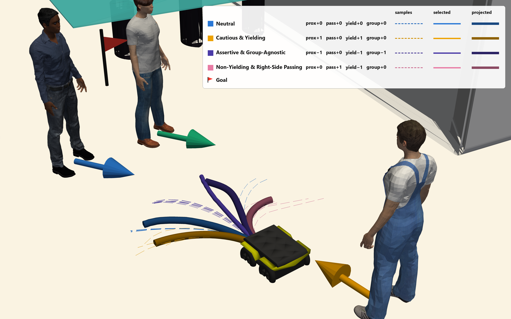

# SoGuDiff — Socially Guided Diffusion for Robot Navigation

> **TODO before release**
> - Replace the four remaining `TODO_*` links below and the venue/year.
> - Fill in authors and the repository URL here and in `CITATION.cff`.
> - Publish the `v1.0` release and make the repository public when the paper is
>   out. `scripts/download_assets.sh` then works as documented, with no token
>   and no edits. (While the repo is private, downloads need a `GITHUB_TOKEN`;
>   that is a temporary condition and is deliberately not documented below.)
> - Add the paper venue and project website link to the GitHub "About" section.
>
> Everything else is ready.

Reference implementation for
**SoGuDiff: Socially Guided Diffusion for Steerable, Norm-Grounded Robot
Navigation** (*TODO: venue, year*).

<p align="center">
  <a href="TODO_ARXIV_URL"><b>arXiv</b></a> &nbsp;·&nbsp;
  <a href="TODO_PAPER_PDF_URL"><b>Paper</b></a> &nbsp;·&nbsp;
  <a href="TODO_PROJECT_PAGE_URL"><b>Project page</b></a> &nbsp;·&nbsp;
  <a href="TODO_YOUTUBE_URL"><b>Video</b></a> &nbsp;·&nbsp;
  <a href="https://github.com/schaiblc/SoGuDiff/releases/tag/v1.0"><b>Weights &amp; data</b></a>
</p>

<p align="center">
  
</p>

SoGuDiff is a conditional diffusion planner for social robot navigation. It
generates trajectories conditioned on the crowd, a static occupancy map, and a
four-dimensional **style vector** — proxemic distance, passing side, yielding,
and group deference — with classifier-free guidance applied per style axis, so
axes can be followed independently or composed at inference. A feasibility
projection layer then refines the selected trajectory toward one that respects
the robot's unicycle dynamics and obstacle clearances, separating learned
social behavior from kinematic feasibility.

This repository contains the full pipeline behind the paper: scene generation,
expert demonstration synthesis, diffusion training, the evaluation harness, and
all ten baselines under one common action space.

---

## Contents

| Path | What it is |
|---|---|
| `sogudiff/` | The method: diffusion training, the social cost model, and expert demonstration generation |
| `crowdnav_env/` | Simulator, policy implementations, and the evaluation harness. Installable as the `crowdnav` package |
| `baselines/` | Vendored forks of the four baselines that needed retraining. See [`baselines/NOTICE.md`](baselines/NOTICE.md) |
| `scenegen/` | Occupancy maps and scene sets, built from Matterport3D, InteriorGS and TartanGround |
| `scripts/` | Asset download, a scheduler-free baseline runner, and SLURM wrappers |
| `checkpoints/`, `data/` | Where downloaded weights and scene sets land. Empty in git |
| `diffusers_unet_1d_condition/` | Vendored Diffusers UNet1D fork, extended for cross-attention conditioning |
| `docs/` | [Install](docs/INSTALL.md) · [Running](docs/RUNNING.md) · [Reproduction](docs/REPRODUCTION.md) |

---

## Quick start

```bash
git clone <REPO URL> sogudiff && cd sogudiff

python3.10 -m venv .venv && source .venv/bin/activate

# gym 0.21 must be installed first, under its own toolchain -- see docs/INSTALL.md
pip install "pip==23.3.2"
pip install "setuptools==65.5.0" "wheel==0.38.4"
pip install --no-build-isolation "gym==0.21.0"

pip install -r requirements/main.txt
pip install -e crowdnav_env

# Python-RVO2 has no PyPI distribution; every policy imports it. Needs cmake.
pip install "Cython<3"
git clone https://github.com/sybrenstuvel/Python-RVO2.git
cd Python-RVO2 && python setup.py build && pip install --no-build-isolation . && cd ..
```

Those version pins are not cosmetic — `gym` 0.21 does not build under a current
pip/setuptools/wheel, and installing it as part of `requirements/main.txt`
aborts the whole file. [docs/INSTALL.md](docs/INSTALL.md) explains why.

Verify the install without downloading anything — ORCA needs no weights:

```bash
cd crowdnav_env/crowd_nav
python evaluate.py --policy orca_unicycle --phase test --no_video
```

That generates its scenes procedurally rather than loading the released set, so
it needs no download. It runs 500 short episodes in well under a minute.

Then fetch the model weights (~710 MB):

```bash
scripts/download_assets.sh weights
```

That brings down `checkpoints/sogudiff_single_axis.pt` — **the model behind
every reported result**, and the default in `configs/policy.config` — plus the
baseline weights. A second checkpoint, `sogudiff_joint.pt`, is included only
for the composition-scheme ablation, which compares single-axis against joint
training; nothing else needs it.

and run the proposed method on the 500-scene benchmark:

```bash
cd crowdnav_env/crowd_nav
python evaluate.py \
    --policy sogudiff \
    --infer_mode per_axis --w_normalize --gpu --no_video \
    --results_suffix sogudiff
```

Those 500 scenes are **generated procedurally** from `configs/env.config`
(`test_sim = evaluation`, `test_size = 500`, fixed per-scene seeds), so the
comparison table needs no scene download and every method sees identical
scenes. The saved scene set under `data/scenes/` is a separate, hand-built
collection used by the style and composition experiments; fetch it with
`scripts/download_assets.sh eval-scenes` when you get to those.

Two things are not in `requirements/main.txt` and are worth knowing about
before you start: **acados**, which the projection layer compiles against, and
the **separate environment SICNav needs**. Both are covered in
[docs/INSTALL.md](docs/INSTALL.md). Every other policy runs without them.

---

## Reproducing the comparison table

One command, no scheduler required:

```bash
scripts/run_baseline_table.sh                    # all methods, 500 scenes
scripts/run_baseline_table.sh --only ORCA,SFM    # a subset first
```

It runs each method in turn and prints its summary. Budget several hours for
the full sweep; per-method results land in
`crowdnav_env/crowd_nav/results_<METHOD>/`.

On a SLURM cluster, the same runs parallelize across jobs:

```bash
cp scripts/slurm/cluster_env.sh scripts/slurm/cluster_env.local.sh
$EDITOR scripts/slurm/cluster_env.local.sh      # account, partition, env activation

# If your site requires an account or a partition, give it to sbatch -- the
# wrappers carry none, so they stay portable. Skip this if you have only one
# association, as sbatch will then pick it for you.
export SBATCH_ACCOUNT=your-account

sbatch scripts/slurm/evaluate.slurm sogudiff
sbatch scripts/slurm/evaluate.slurm sarl models/sarl
sbatch scripts/slurm/evaluate_sicnav.slurm
```

The SLURM scripts are thin wrappers: each one activates an environment and runs
a `python ...` command that its header comment spells out verbatim, so you can
lift that command onto any other scheduler — or none.

---

## Baselines

All eleven methods are evaluated on identical scenes under the same unicycle
action space and the same metrics.

| Method | Policy name | Kind |
|---|---|---|
| ORCA | `orca_unicycle` | Reactive, velocity obstacles |
| SFM | `sfm_unicycle` | Reactive, social force |
| CADRL | `cadrl` | Value-based RL |
| LSTM-RL | `lstm_rl` | Value-based RL |
| SARL | `sarl` | Attention-based RL |
| RGL | `rgl` | Relational graph learning |
| DSRNN | `dsrnn` | Structural RNN, PPO |
| NaviSTAR | `navistar` | Graph transformer, SAC |
| HEIGHT | `height` | Interaction graph transformer, PPO |
| SICNav | `sicnav` | Bilevel MPC (CasADi/IPOPT) |
| **SoGuDiff** | `sogudiff` | **This work** |

### How each baseline is provided

Nothing needs cloning. Every baseline's code ships in this repository; only the
trained weights are downloaded.

**Reimplemented in-tree** — ORCA, SFM, CADRL, LSTM-RL, SARL and RGL live in
`crowdnav_env/crowd_nav/policy/` and `crowdnav_env/crowd_sim/envs/policy/`,
inherited from the CrowdNav and RelationalGraphLearning codebases this
simulator is built on. They train through `train_rl_baseline.py` and load from
`crowdnav_env/crowd_nav/models/<name>/`. ORCA and SFM are analytic and need no
weights at all, which is why they run straight after `pip install`.

**Vendored forks** — DSRNN, NaviSTAR, HEIGHT and SICNav have their own training
stacks that could not be folded into this one, so each is vendored whole under
`baselines/<name>/`, modified to train on this paper's task. A thin adapter in
`crowd_nav/policy/<name>.py` loads the resulting checkpoint and exposes it
through the shared policy interface, so the same harness scores it. Upstream
URLs, licenses and the exact changes are in
[`baselines/NOTICE.md`](baselines/NOTICE.md).

The forks are vendored rather than referenced as submodules because the paper's
numbers depend on those modifications: an unmodified upstream clone trains on a
different task and reproduces something else.

### Kinematics

Every method acts through the same unicycle action space. SFM, ORCA and SICNav
are adapted to emit unicycle actions directly; CADRL, LSTM-RL, SARL and RGL are
retrained under unicycle dynamics. DSRNN, NaviSTAR and HEIGHT did not converge
when retrained unicycle-native, so each keeps its authors' holonomic training
and has the unicycle limits enforced at evaluation time.

The `*_holonomic` policy names run those three checkpoints under their native
dynamics instead. They are diagnostic variants for measuring what the
conversion costs, are **not** reported in the paper, and are not comparable to
the table rows. See [docs/REPRODUCTION.md](docs/REPRODUCTION.md).

`mppi_expert` is an ablation rather than a literature baseline: it runs the
demonstration generator's own sampling-based planner online at its full search
budget, sharing the projection back-end with SoGuDiff so that a metric
difference is attributable to the planner and not to the feasibility layer.

---

## The pipeline

```
  scenegen/occupancy_from_{matterport,tartanground,interiorgs}.py
                  |                         raw scans -> occupancy maps
  scenegen/generate_random_maps.py          maps      -> 50x50 navigable crops
                  |
  scenegen/generate_scenes.py               crops     -> scenes (crowd, goals, obstacles)
  scenegen/generate_scenes_custom.py        (procedural scenes, no map input)
                  |
  sogudiff/generate_expert_trajectories.py  scenes    -> style-labelled demonstrations
                  |                         
  sogudiff/train.py                         demos     -> checkpoint
                  |
  crowd_nav/evaluate.py                     checkpoint -> metrics
```

Four map sources feed it: Matterport3D, TartanGround and InteriorGS supply real
indoor geometry, and a procedural generator supplies harder synthetic layouts.

**The demonstration source is not part of the method.** Training reads
style-labelled `.npz` trajectories and never asks how they were produced, so a
different planner, an optimization-based expert, or human teleoperation can
replace the sampling-based generator used here — everything downstream is
unchanged. [docs/RUNNING.md](docs/RUNNING.md#training-on-your-own-demonstrations)
gives the field schema.

The pipeline produced 2.96M demonstrations across 450,000 scenes; the released
model trains on 1,486,283 of them, selected by style arm at load time rather
than merged on disk. **That is what was used, not what is required** — every
stage takes a count argument and scales linearly, so generate whatever size you
want directly. [docs/RUNNING.md](docs/RUNNING.md) gives the per-source
breakdown, the arm split, and the command for each stage.

Each stage writes what the next one reads, and each can be skipped by
downloading that stage's output instead — see
[assets/MANIFEST.md](assets/MANIFEST.md). Most users start at the last step:
download the weights and evaluate.

Only the Matterport occupancy step needs a different environment
(`habitat-sim`); everything after it runs in the main one.

## Training from scratch

The full pipeline, in order. Each stage's output is the next stage's input, and
each can be skipped by downloading that stage's output instead — see
[assets/MANIFEST.md](assets/MANIFEST.md).

1. **Occupancy maps** from 3D scans (`scenegen/occupancy_from_matterport.py`).
   Needs the separate `requirements/scenegen.txt` environment, and your own
   licensed copy of the source datasets.
2. **Scenes** — crowds, goals and static obstacles sampled onto those maps
   (`scenegen/generate_scenes.py`).
3. **Expert demonstrations** — multi-modal, style-labelled trajectories from a
   sampling-based MPPI planner (`sogudiff/generate_expert_trajectories.py`).
   This is the expensive stage: CPU-bound and
   resumable through per-scene `.done` markers.
4. **Diffusion training** (`sogudiff/train.py`), ~500k-1M steps on one GPU.

```bash
python sogudiff/train.py \
    --dataset_dirs data/expert/custom data/expert/interiorgs \
                   data/expert/matterport data/expert/tartanground \
    --arm_counts "neutral=all,axis=all" --file_seed 42 \
    --exp_name sogudiff_single_axis --cfg_mode union --use_map \
    --batch_size 128 --lr 2e-4 --num_steps 1000000 \
    --num_diffusion_timesteps 100 --horizon 32 --token_dim 128
```

That is the recipe behind the released checkpoint. `--dataset_dirs` reads the
source directories in place and `--arm_counts` selects which style arms to
train on, so nothing has to be merged or subsampled on disk. A single merged
directory works too, via `--dataset_dir`.

Training resumes from the newest checkpoint in `checkpoints/<exp_name>/`, so
re-running continues rather than restarting. Pass `--no_wandb` to skip
experiment tracking.

[docs/RUNNING.md](docs/RUNNING.md) covers each stage's arguments, the style
sweeps and composition experiments, and how to render comparison videos.

---

## Citation

```bibtex
@inproceedings{TODO_citekey,
  title     = {TODO: paper title},
  author    = {TODO: author list},
  booktitle = {TODO: venue},
  year      = {2026}
}
```

## License

MIT — see [LICENSE](LICENSE). This repository incorporates code from CrowdNav,
RelationalGraphLearning, HuggingFace Diffusers and four baseline projects, each
under its own license; [NOTICE.md](NOTICE.md) records what came from where.
Occupancy maps derive from Matterport3D, InteriorGS and TartanGround, each with
its own terms — see [assets/MANIFEST.md](assets/MANIFEST.md).

## Acknowledgements

The simulator and evaluation harness build on
[CrowdNav](https://github.com/vita-epfl/CrowdNav). Baseline implementations come
from their authors' released code; see [`baselines/NOTICE.md`](baselines/NOTICE.md)
for per-project attribution.
